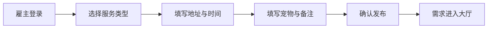
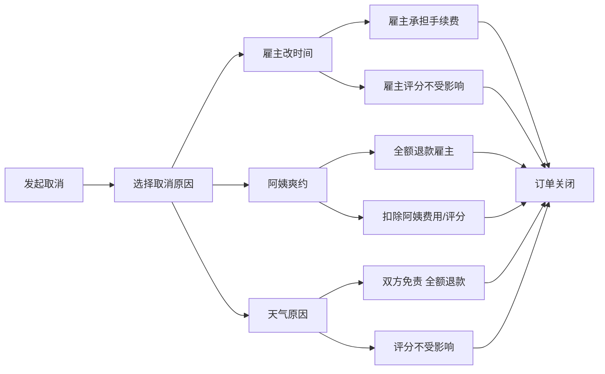

## 1. 产品概述

家政阿姨接单站是连接雇主与家政服务人员的O2O平台，雇主可发布保洁、做饭、陪护等服务需求，阿姨在线接单并通过状态更新实现服务全流程透明化，取消责任判定机制保障双方权益。

- 解决家政服务信息不对称、服务流程不透明、纠纷责任不清的痛点
- 目标用户：有家政服务需求的雇主家庭、提供家政服务的阿姨/服务人员

## 2. 核心功能

### 2.1 用户角色

| 角色 | 注册方式 | 核心权限 |
|------|----------|----------|
| 雇主 | 手机号注册 | 发布需求、管理订单、评价阿姨、查看账单 |
| 阿姨 | 手机号注册+资质认证 | 接单、更新服务状态、查看收入、管理评价 |

### 2.2 功能模块

1. **首页大厅**：需求列表展示、角色切换入口、搜索筛选
2. **需求发布**：选择服务类型、填写地址时间、宠物信息、特别要求
3. **订单管理**：订单列表、订单详情、状态跟踪、照片查看
4. **接单大厅**：阿姨视角的可接需求列表、一键接单
5. **取消流程**：原因选择（雇主改时间/阿姨爽约/天气原因）、费用计算、评分影响
6. **个人中心**：角色切换、我的订单、我的评分、钱包余额

### 2.3 页面详情

| 页面名称 | 模块名称 | 功能描述 |
|----------|----------|----------|
| 首页（雇主） | 需求发布入口 | 快速发布保洁/做饭/陪护需求 |
| 首页（雇主） | 进行中订单卡片 | 展示当前进行中的订单状态 |
| 首页（雇主） | 历史订单列表 | 查看历史订单记录 |
| 需求发布页 | 服务类型选择 | 保洁/做饭/陪护三选一 |
| 需求发布页 | 地址时间表单 | 详细地址、服务日期、服务时长 |
| 需求发布页 | 宠物与备注 | 是否有宠物、宠物类型、特别要求 |
| 订单详情页 | 状态时间轴 | 待接单→已接单→出发→到达→完成 |
| 订单详情页 | 服务照片墙 | 阿姨上传的服务现场照片 |
| 订单详情页 | 取消按钮 | 发起取消并选择原因 |
| 接单大厅（阿姨） | 需求列表 | 附近可接单需求卡片展示 |
| 接单大厅（阿姨） | 一键接单 | 接单确认弹窗 |
| 阿姨订单详情 | 状态更新按钮 | 出发/到达/完成操作 |
| 阿姨订单详情 | 照片上传 | 服务完成后上传照片 |
| 个人中心 | 角色切换 | 雇主/阿姨身份切换 |
| 个人中心 | 我的评分 | 评分展示、评价列表 |
| 个人中心 | 我的钱包 | 余额、收支明细 |

## 3. 核心流程

### 3.1 雇主发布需求流程

雇主登录 → 选择服务类型 → 填写地址/时间/宠物信息/特别要求 → 确认发布 → 需求进入接单大厅

### 3.2 阿姨接单与服务流程

阿姨登录 → 浏览接单大厅 → 选择需求接单 → 更新出发状态 → 更新到达状态 → 完成服务 → 上传照片 → 订单完成

### 3.3 订单取消流程

发起取消 → 选择取消原因 → 系统计算退款/扣款 → 更新评分 → 订单关闭

## 4. 用户界面设计

### 4.1 设计风格

- **主色调**：暖橙色 `#FF8C42` — 传递温暖、亲切、可信赖的家政服务氛围
- **辅助色**：深橄榄绿 `#4A7C59` — 代表专业、可靠、环保健康
- **中性色**：米白 `#FDF8F3`、暖灰 `#8B8680`、深棕 `#3D3A36`
- **按钮风格**：圆润胶囊形按钮，带微浮起阴影，hover时有轻微下沉效果
- **字体**：标题使用「思源宋体」展现温暖质感，正文使用「思源黑体」保证可读性
- **布局风格**：卡片式布局，柔和圆角（16px），轻投影，米色纸质质感背景
- **图标风格**：线性图标搭配暖橙色填充点，手绘感温馨风格

### 4.2 页面设计概述

| 页面名称 | 模块名称 | UI元素 |
|----------|----------|--------|
| 首页 | 顶部导航 | 角色切换标签、消息图标、头像入口 |
| 首页 | Hero区 | 温暖插画背景、搜索框、快捷服务入口 |
| 首页 | 需求卡片 | 服务类型标签、价格、地址、时间、宠物标识 |
| 需求发布页 | 步骤指示器 | 三步式进度条 |
| 需求发布页 | 表单 | 大输入框、选项标签、日期选择器 |
| 订单详情页 | 状态时间轴 | 竖线连接的圆形节点，当前状态高亮 |
| 订单详情页 | 照片墙 | 瀑布流布局、点击放大预览 |
| 个人中心 | 顶部信息卡 | 头像、评分、余额概览 |

### 4.3 响应式

- 桌面端优先设计，适配移动端
- 移动端卡片宽度自适应，单列布局
- 触摸优化：按钮最小高度44px，足够点击区域
- 底部导航栏在移动端显示，桌面端使用侧边导航

### 4.4 动效设计

- 页面切换采用淡入淡出+轻微上移动画
- 状态更新时时间轴节点有脉冲扩散动画
- 卡片hover时有轻微上浮和阴影加深
- 按钮点击有弹性反馈效果
