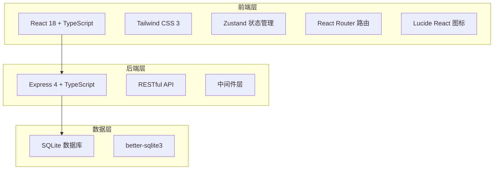
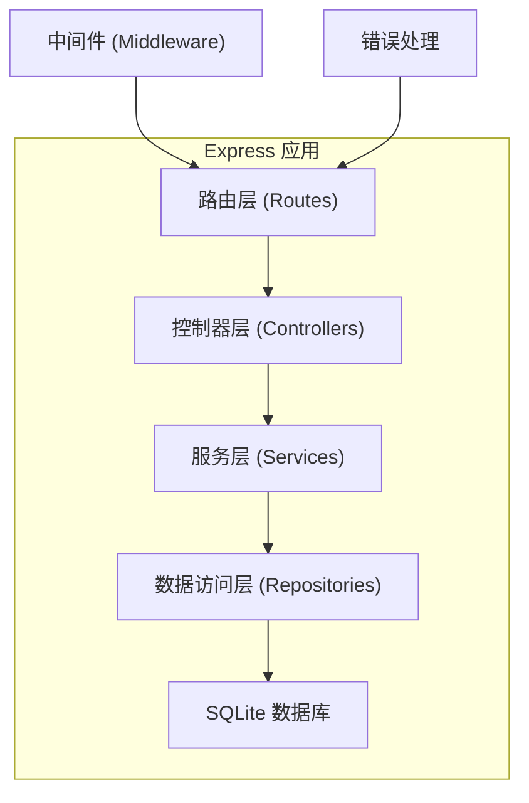
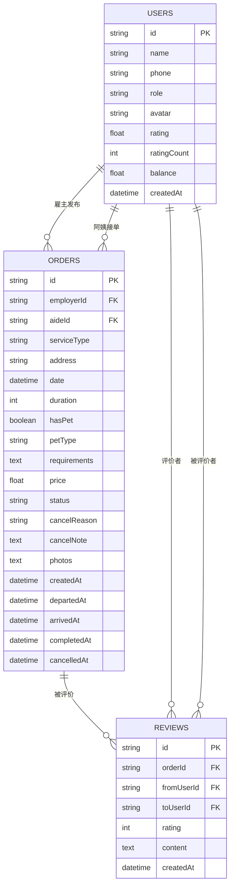

## 1. 架构设计



## 2. 技术描述

- **前端**：React@18 + TypeScript + Vite + TailwindCSS@3 + Zustand + React Router
- **初始化工具**：vite-init
- **后端**：Express@4 + TypeScript + better-sqlite3
- **数据库**：SQLite（本地文件数据库，零配置，适合原型开发）
- **图标库**：lucide-react
- **样式方案**：Tailwind CSS + CSS 变量主题系统

## 3. 路由定义

| 路由 | 页面 | 用途 |
|------|------|------|
| `/` | 首页（雇主） | 需求列表、快捷发布入口、进行中订单 |
| `/publish` | 需求发布页 | 发布保洁/做饭/陪护需求 |
| `/order/:id` | 订单详情页 | 查看订单状态、时间轴、照片 |
| `/hall` | 接单大厅（阿姨） | 阿姨视角浏览可接单需求 |
| `/profile` | 个人中心 | 角色切换、我的订单、评分、钱包 |
| `/login` | 登录页 | 角色选择登录 |

## 4. API 定义

### 4.1 类型定义

```typescript
// 服务类型
type ServiceType = 'cleaning' | 'cooking' | 'care';

// 订单状态
type OrderStatus = 'pending' | 'accepted' | 'departed' | 'arrived' | 'completed' | 'cancelled';

// 取消原因
type CancelReason = 'employer_reschedule' | 'aide_no_show' | 'weather';

// 用户角色
type UserRole = 'employer' | 'aide';

// 用户
interface User {
  id: string;
  name: string;
  phone: string;
  role: UserRole;
  avatar?: string;
  rating: number;
  ratingCount: number;
  balance: number;
  createdAt: string;
}

// 需求/订单
interface Order {
  id: string;
  employerId: string;
  aideId?: string;
  serviceType: ServiceType;
  address: string;
  date: string;
  duration: number; // 小时
  hasPet: boolean;
  petType?: string;
  requirements: string;
  price: number;
  status: OrderStatus;
  cancelReason?: CancelReason;
  cancelNote?: string;
  photos: string[];
  createdAt: string;
  departedAt?: string;
  arrivedAt?: string;
  completedAt?: string;
  cancelledAt?: string;
}

// 评价
interface Review {
  id: string;
  orderId: string;
  fromUserId: string;
  toUserId: string;
  rating: number;
  content: string;
  createdAt: string;
}
```

### 4.2 接口列表

| 方法 | 路径 | 描述 |
|------|------|------|
| GET | `/api/orders` | 获取订单列表（按角色过滤） |
| GET | `/api/orders/:id` | 获取订单详情 |
| POST | `/api/orders` | 发布新需求（雇主） |
| PUT | `/api/orders/:id/accept` | 接单（阿姨） |
| PUT | `/api/orders/:id/status` | 更新订单状态（出发/到达/完成） |
| POST | `/api/orders/:id/photos` | 上传服务照片 |
| PUT | `/api/orders/:id/cancel` | 取消订单 |
| GET | `/api/users/:id` | 获取用户信息 |
| GET | `/api/users/:id/reviews` | 获取用户评价列表 |

## 5. 服务器架构图



## 6. 数据模型

### 6.1 ER 图



### 6.2 DDL 语句

```sql
-- 用户表
CREATE TABLE users (
  id TEXT PRIMARY KEY,
  name TEXT NOT NULL,
  phone TEXT UNIQUE NOT NULL,
  role TEXT NOT NULL CHECK (role IN ('employer', 'aide')),
  avatar TEXT,
  rating REAL DEFAULT 5.0,
  rating_count INTEGER DEFAULT 0,
  balance REAL DEFAULT 0.0,
  created_at TEXT NOT NULL
);

-- 订单表
CREATE TABLE orders (
  id TEXT PRIMARY KEY,
  employer_id TEXT NOT NULL,
  aide_id TEXT,
  service_type TEXT NOT NULL CHECK (service_type IN ('cleaning', 'cooking', 'care')),
  address TEXT NOT NULL,
  date TEXT NOT NULL,
  duration INTEGER NOT NULL,
  has_pet INTEGER NOT NULL DEFAULT 0,
  pet_type TEXT,
  requirements TEXT,
  price REAL NOT NULL,
  status TEXT NOT NULL DEFAULT 'pending' CHECK (status IN ('pending', 'accepted', 'departed', 'arrived', 'completed', 'cancelled')),
  cancel_reason TEXT CHECK (cancel_reason IN ('employer_reschedule', 'aide_no_show', 'weather')),
  cancel_note TEXT,
  photos TEXT DEFAULT '[]',
  created_at TEXT NOT NULL,
  departed_at TEXT,
  arrived_at TEXT,
  completed_at TEXT,
  cancelled_at TEXT,
  FOREIGN KEY (employer_id) REFERENCES users(id),
  FOREIGN KEY (aide_id) REFERENCES users(id)
);

-- 评价表
CREATE TABLE reviews (
  id TEXT PRIMARY KEY,
  order_id TEXT NOT NULL,
  from_user_id TEXT NOT NULL,
  to_user_id TEXT NOT NULL,
  rating INTEGER NOT NULL CHECK (rating >= 1 AND rating <= 5),
  content TEXT,
  created_at TEXT NOT NULL,
  FOREIGN KEY (order_id) REFERENCES orders(id),
  FOREIGN KEY (from_user_id) REFERENCES users(id),
  FOREIGN KEY (to_user_id) REFERENCES users(id)
);

-- 索引
CREATE INDEX idx_orders_status ON orders(status);
CREATE INDEX idx_orders_employer_id ON orders(employer_id);
CREATE INDEX idx_orders_aide_id ON orders(aide_id);
CREATE INDEX idx_reviews_to_user_id ON reviews(to_user_id);

-- 初始数据
INSERT INTO users (id, name, phone, role, avatar, rating, rating_count, balance, created_at) VALUES
('emp_001', '李女士', '13800000001', 'employer', NULL, 5.0, 3, 500.0, datetime('now')),
('aide_001', '王阿姨', '13900000001', 'aide', NULL, 4.8, 25, 1200.0, datetime('now')),
('aide_002', '张阿姨', '13900000002', 'aide', NULL, 4.9, 42, 2100.0, datetime('now'));

INSERT INTO orders (id, employer_id, aide_id, service_type, address, date, duration, has_pet, pet_type, requirements, price, status, created_at) VALUES
('ord_001', 'emp_001', NULL, 'cleaning', '北京市朝阳区建国路88号', date('now', '+1 day'), 3, 1, '一只英短猫', '需要重点打扫厨房和卫生间，注意关好门不要让猫跑出去', 180.0, 'pending', datetime('now')),
('ord_002', 'emp_001', 'aide_001', 'cooking', '北京市朝阳区建国路88号', date('now'), 2, 0, NULL, '做三人份晚餐，清淡口味，不要辣', 120.0, 'accepted', datetime('now', '-1 hour'));
```
